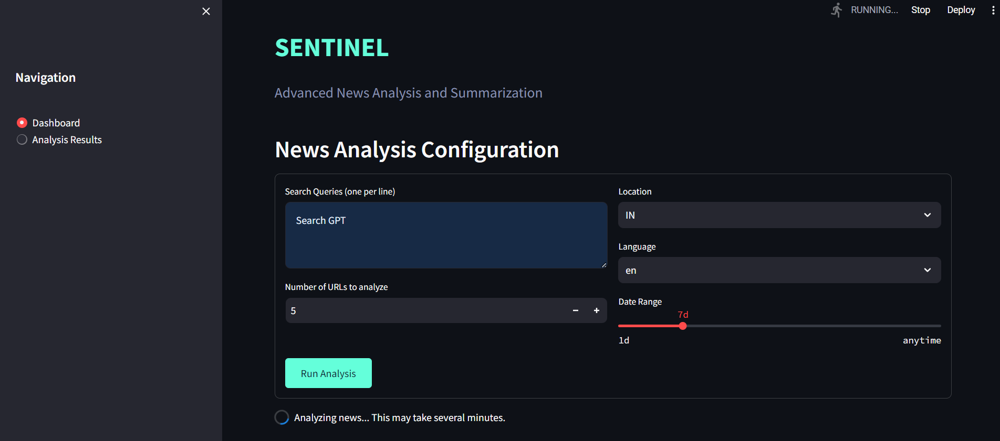
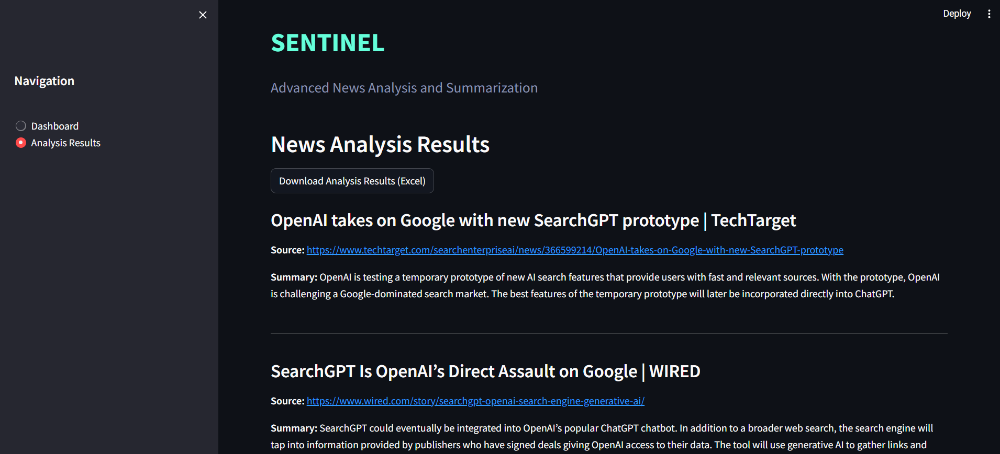

# SENTINEL
(Summarizing and Extracting News Information System): Implies a vigilant guardian that keeps watch over news.

SENTINEL is a Streamlit-based application for visualizing and monitoring news articles. This README provides instructions to clone the repository, install the required dependencies, and run the application.






## Getting Started

### Prerequisites

Make sure you have the following installed on your machine:

- Python 3.8 or higher
- Git

### Installation

Follow these steps to set up the project on your local machine:

1. **Clone the repository**

   Open your terminal or command prompt and run the following command to clone the repository:

   ```bash
   git clone https://github.com/soumilsuri/SENTINEL.git
   ```

2. **Navigate to the project directory**

   Change to the project directory using the following command:

   ```bash
   cd SENTINEL
   ```

3. **Create a virtual environment (optional but recommended)**

   It is recommended to create a virtual environment to manage dependencies. Run the following commands:

   ```bash
   python -m venv venv
   source venv/bin/activate   # On Windows use `venv\Scripts\activate`
   ```

4. **Install the required dependencies**

   Install the dependencies listed in the `requirements.txt` file by running:

   ```bash
   pip install -r requirements.txt
   ```

### Running the Application

To start the Streamlit application, run the following command:

```bash
streamlit run app.py
```

This will start the Streamlit server, and you can view the application in your web browser at `http://localhost:8501`.

## Contributing

Contributions are welcome! Please open an issue or submit a pull request for any improvements or bug fixes.

## License

This project is licensed under the MIT License - see the [LICENSE](LICENSE) file for details.
